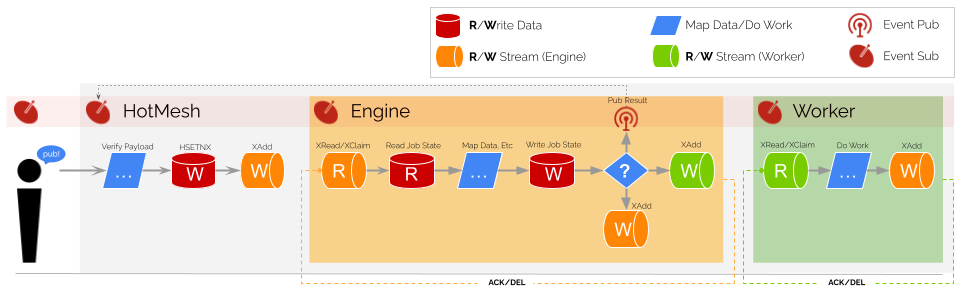

# samples-typescript
This repo demonstrates the use of HotMesh in a TypeScript environment. The samples are built using HotMesh's `Durable` module which is an emulation of Temporal's TypeScript SDK. Both `proxyActivities` and `executeChild` are reflected in the samples.

Here, for example, is the `looper` workflow. It calls two activities *sequentially* and three child workflows in *parallel*. The workflow is defined in `./services/durable/looper/workflows.ts`:

```typescript
import { Durable } from '@hotmeshio/hotmesh';
import type * as activities from './activities';

const { looper } = Durable.workflow.proxyActivities<typeof activities>();

export async function looperExample(name: string): Promise<Record<string, string>> {
  const loopVal1 = await looper(`${name} - 1`);
  const loopVal2 = await looper(`${name} - 2`);

  const [
    parentWorkflowOutput,
    childWorkflowOutput,
    helloworldWorkflowOutput,
  ] = await Promise.all([

    Durable.workflow.executeChild<string>({
      args: [`${name} to PARENT`],
      taskQueue: 'parent',
      workflowName: 'parentExample',
      workflowId: '-'
    }),
  
    Durable.workflow.executeChild<string>({
      args: [`${name} to CHILD`],
      taskQueue: 'child',
      workflowName: 'childExample',
      workflowId: '-'
    }),

    Durable.workflow.executeChild<string>({
      args: [`${name} to HELLOWORLD`],
      taskQueue: 'helloworld',
      workflowName: 'helloworldExample',
      workflowId: '-'
    }),
  ]);

  return {
    loopVal1,
    loopVal2,
    parentWorkflowOutput,
    childWorkflowOutput,
    helloworldWorkflowOutput
  };
}
```

The docker-compose file spins up **two** Node instances and a single Redis instance. The Node instances start different durable workers. Execute the `remote` demo (described below) to run a cross-container workflow, where the *request* is handled by one Node instance (`service_a`) and the *workflow* is executed by another (`service_b`).

## Telemetry Keys
*Optionally*, add a `.env` file to the project root and include your keys for honeycomb open telemetry if you wish to use the default tracer configuration located in `./services/tracer.ts`. The following keys are required to enable the default tracer in this project (but you can add your own tracer configuration and supporting keys if you use a different OpenTelemetry provider).

```
HONEYCOMB_API_KEY=XXXXXXXXXX
OTEL_SERVICE_NAME=yyyy
```

>If you don't have a Honeycomb account, you can sign up for a free trial [here](https://ui.honeycomb.io/signup).

## Build
The application includes a docker-compose file that spins up one Redis instance and one Node instance. To build the application, run the following command:

```bash
docker-compose up --build -d
```

>The Node instance initializes a Fastify HTTP server and starts the various durable workers needed for the demo.

## Run
Open a browser and navigate to `http://localhost:3002/apis/v1/test/helloworld` to invoke the `helloworld` workflow. Additional workflows can be tested by invoking them in the same manner (e.g., `v1/test/helloworld`, `v1/test/child`, `v1/test/parent`, `v1/test/looper`, `v1/test/remote`).

### Visualize | OpenTelemetry
You will see the full OpenTelemetry execution tree organized as a DAG (if you provided credentials for HoneyComb/etc), allowing you to configure dashboards and alerts as the processes execute. The following graph represents the execution of the `looper` workflow. That worflow includes two *sequential* activity calls (`proxyActivity`) and three nested *parallel* workflow calls (`executeChild`). The times shown are the total execution time for each node in the graph. Every node in the graph is a separate span in the OpenTelemetry trace and can be expanded for more detail about the subprocess.


### Visualize | RedisInsight
You can also visualize the Redis queue and workflow execution by using RedisInsight. The following image shows the RedisInsight dashboard for the `looper` workflow. HotMesh collocates version, data, and execution instructions to Redis, allowing you full visibility into the journaled data.


The above image reflects the initiation of a HotMesh workflow. Workflows execute and complete without any outside input (aside from the initial request). All other activities are driven by queue semantics, leveraging Redis Streams to guarantee a cascading chain of activities, through the simple act of reading from one queue and writing to another. Consider the following image that reflects the essence of every HotMesh workflow, namely, a volley between worker and engine, driven by queue semantics:




## Extend
Extend the examples by adding additional workflows. Three updates are needed to successfully deploy:
 * Add the new *workflow* to the `./services/durable/` directory.
 * Register a new *worker* in `./web/service.ts`;
 * Register a new HTTP route in `./web/routes/test.ts`